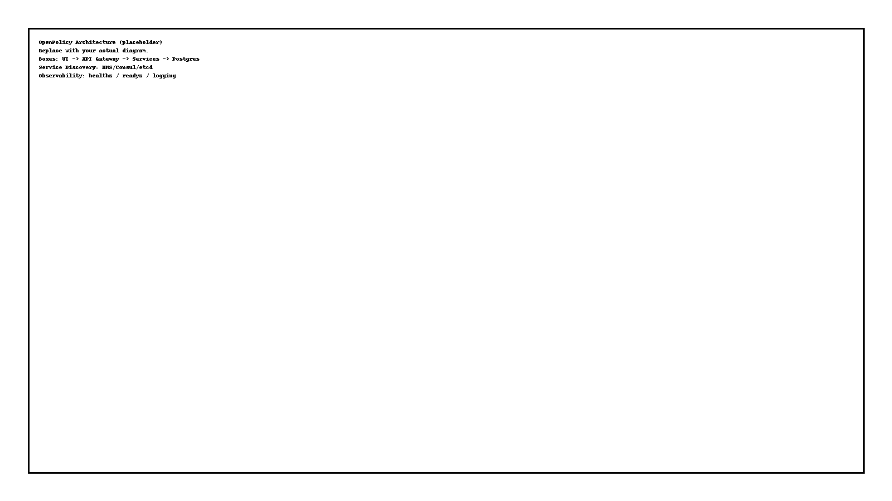

# Architecture (Current)

> This is the authoritative architecture document and diagram for the platform.
> The deprecated services doc lives in docs/LEGACY/ and must not be used.

## Diagram

## Overview
- API Gateway → services via service discovery (no static ports).
- ETL → canonical Postgres schema (Alembic migrations).
- Search → Postgres FTS initially; can upgrade later.
- UIs (Web/Mobile/Admin) → API Gateway only.
- Observability → healthz/readyz + metrics; centralized logging.

## Sources of Truth
- UNIFIED_SERVICE_REFERENCE.md (patterns, discovery, ports-from-env)
- openapi.yaml (API contract)
- ADRs (decisions)
- DEPLOYMENT_PROCESS.md (environments, rollout/rollback)

## Change Protocol
1) Update diagram if a boundary changes.
2) Add an ADR for any architectural decision.
3) Update UNIFIED_SERVICE_REFERENCE.md patterns if discovery/config changes.
